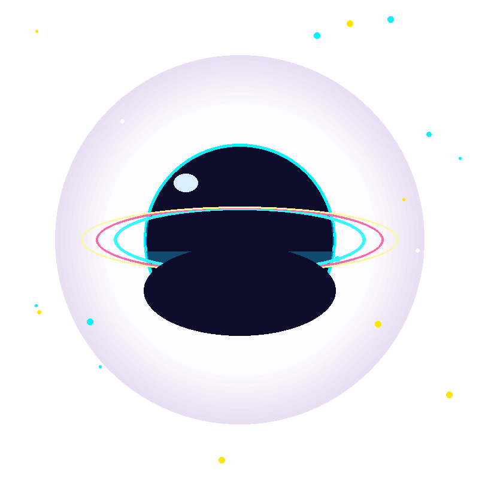
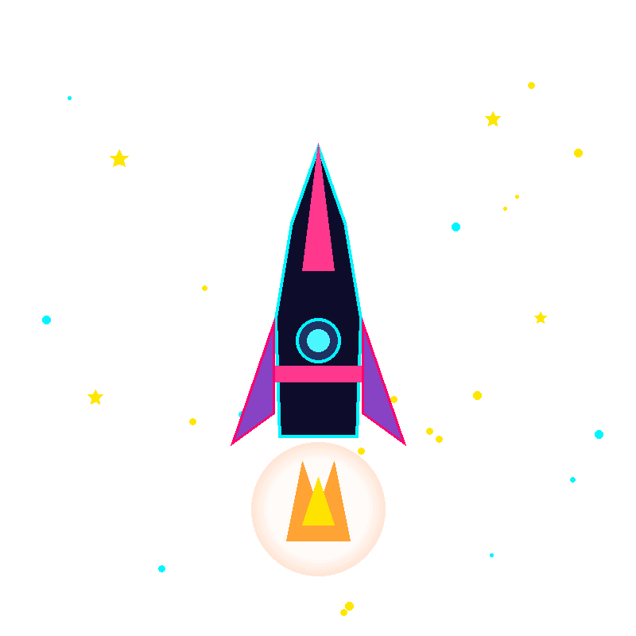
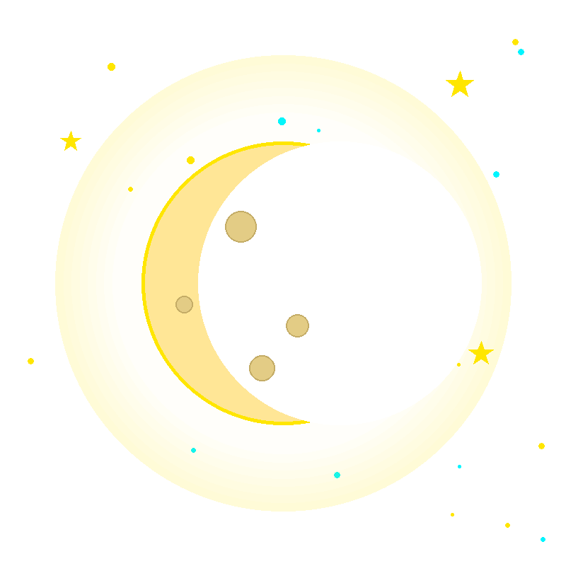
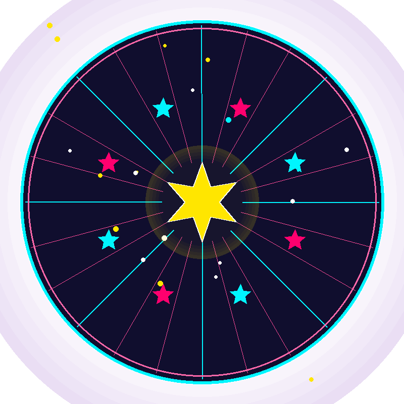
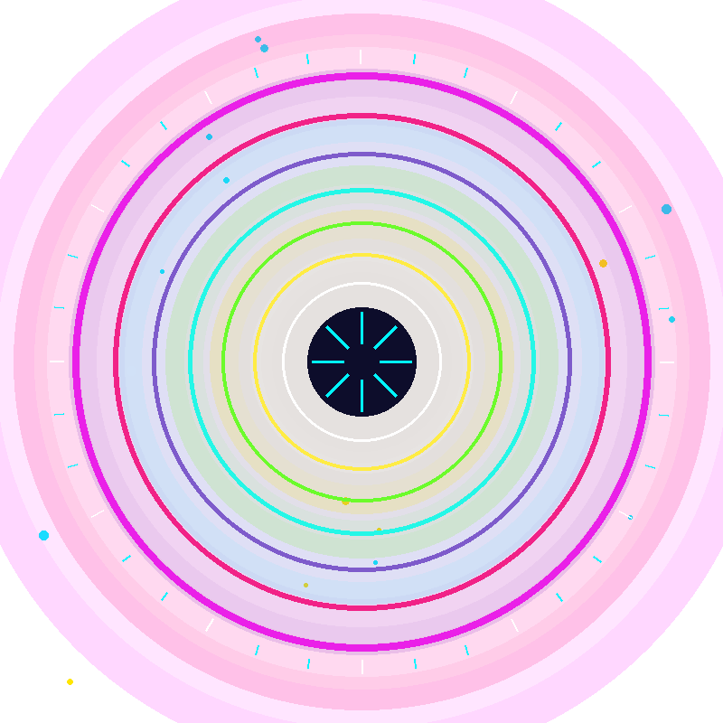
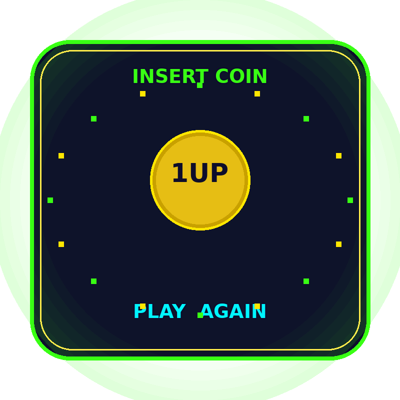
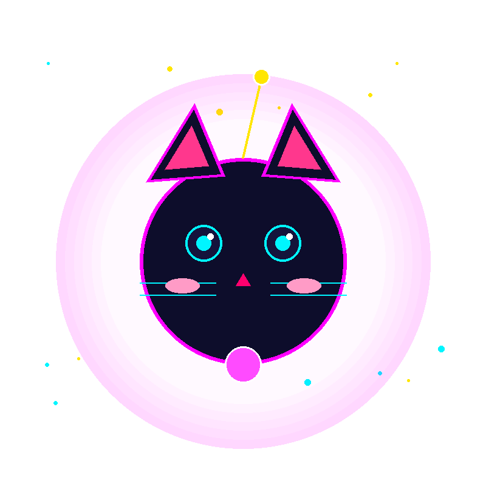

# Retro-Futurist Sticker Generator

Pillow で 800x800 の背景透過 PNG ステッカーを生成するスクリプト集です。
ネオン・Y2K・レトロSF風のパレットを共有した 8 種類のデザインが入っています。

## サンプル

| | | | |
|:--:|:--:|:--:|:--:|
|  |  |  |  |
| `01_neon_planet` | `02_retro_rocket` | `03_pixel_moon` | `04_neon_starfield` |
|  |  |  |  |
| `05_cyber_portal` | `06_arcade_badge` | `07_space_cat` | `08_y2k_burst` |

## セットアップ

```bash
python3 -m venv .venv
source .venv/bin/activate
pip install -r requirements.txt
```

## 使い方

```bash
# 8 種類すべてを output/ に生成
python -m stickers

# デザイン名の一覧
python -m stickers --list

# 特定のデザインだけ生成 (--only は複数指定可)
python -m stickers --only 03_pixel_moon --only 07_space_cat

# 出力先を変更
python -m stickers -o /path/to/dir
```

`output/` は生成物なので Git 管理外です。上記コマンドでいつでも再生成できます。
`docs/samples/` の PNG は README 表示用のコミット済みプレビューです。

## ディレクトリ構成

```
stickers/
├── palette.py          # 共通カラーパレット
├── canvas.py           # キャンバスサイズと描画ヘルパー (グロー・星形・テキスト等)
├── cli.py              # コマンドラインエントリポイント
├── __main__.py         # python -m stickers
└── designs/
    ├── __init__.py     # DESIGNS レジストリ (名前 → draw 関数)
    ├── neon_planet.py
    ├── retro_rocket.py
    ├── pixel_moon.py
    ├── neon_starfield.py
    ├── cyber_portal.py
    ├── arcade_badge.py
    ├── space_cat.py
    └── y2k_burst.py
docs/samples/           # README 用プレビュー画像
output/                 # 生成物 (Git 管理外)
```

## デザインを追加する

1. `stickers/designs/` に新しいモジュールを作り、`draw()` 関数を定義する。
   引数なしで 800x800 の RGBA 画像 (背景は透過) を返す。
   共通パーツは `..canvas` と `..palette` から import する。
2. `stickers/designs/__init__.py` の `DESIGNS` に登録する。
   辞書のキーがそのまま出力ファイル名 (`<キー>.png`) になる。

```python
# stickers/designs/my_design.py
from PIL import ImageDraw

from ..canvas import HALF, add_glow, make_canvas
from ..palette import ELECTRIC_CYAN, NEON_PINK


def draw():
    img = make_canvas()
    img = add_glow(img, (HALF, HALF), 200, NEON_PINK)
    d = ImageDraw.Draw(img)
    d.ellipse([HALF - 100, HALF - 100, HALF + 100, HALF + 100],
              outline=ELECTRIC_CYAN, width=6)
    return img
```

## 再現性について

`add_small_stars()` は seed 付きの `random.Random` を使うため、各デザインの出力は
決定的です。同じ Pillow バージョンなら毎回バイト単位で同一の PNG が生成されます。
